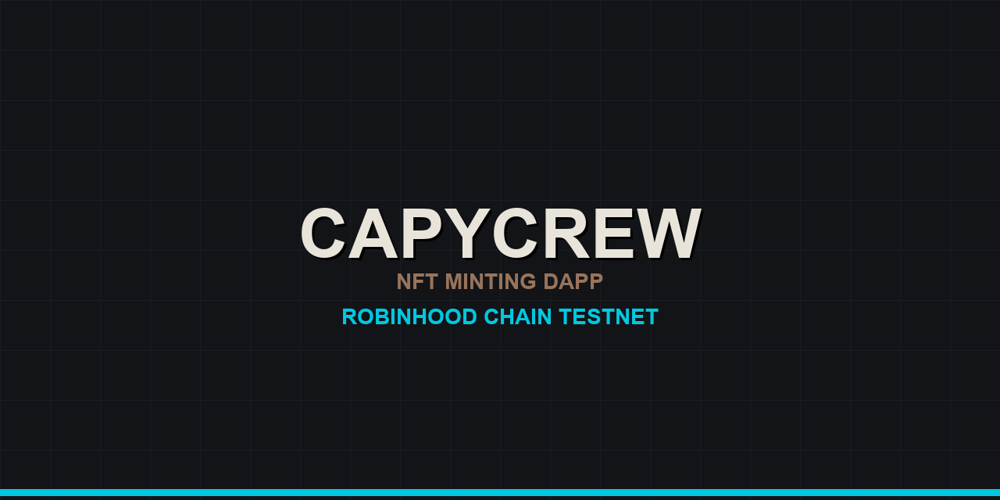

<div align="center">
  
</div>

# CapyCrew

**NFT minting dApp — FastAPI + vanilla JS frontend on Robinhood Chain Testnet**

## Quick start

Run from the repository root:

```powershell
python -m venv .venv
.\.venv\Scripts\Activate.ps1
pip install -r requirements.txt
copy .env.example .env
uvicorn app:app --reload --port 8000
```

Set `MINT_CONTRACT_ADDRESS` in `.env` to the address written by
`smart-contract/deployment/robinhoodTestnet.json`. Leaving it blank is fine: the app falls
back to the public record in `config/deployment.json`. Never commit `.env` or private keys.

## Routes

| Path | What it serves |
|---|---|
| `/` | Home |
| `/hub` | Crew Hub — member loop, collection display, build log |
| `/mint` | Mint portal, or the coming-soon page when `MINT_ENABLED=false` |
| `/whitepaper` | Project direction, $CAPY model, roadmap, risks |
| `/about` | What CapyCrew is |
| `/store` | Merch studies |
| `/privacy` | Privacy policy |
| `/robots.txt`, `/sitemap.xml` | Crawler files, built from `PUBLIC_SITE_URL` |
| `/health` | Render health check |
| `/api/mint/config`, `/api/mint/status`, `/api/mint/wallet/{account}` | Read-only chain state |

The backend exposes only public chain configuration and read-only contract state.
Wallet-signed mint transactions run in the browser. The interactive API docs are off by
default; set `ENABLE_API_DOCS=true` to serve `/docs`, `/redoc`, and `/openapi.json`.

Unknown paths render the branded `404.html`, except under `/api/`, which returns JSON.

## Media layout

Source media lives in `assets/`, `store/`, and `videos/` at the repository root and is
**not** deployed. The served copies live under `media/` and are mounted at `/media/assets`,
`/media/videos`, and `/media/store`. When you add artwork, copy it into the matching
`media/` folder — a template referencing a file that only exists in the source folder will
404 in production.

## Deploy to Render

The site runs as a Render **web service**:

- Build command: `pip install -r requirements.txt`
- Start command: `uvicorn app:app --host 0.0.0.0 --port $PORT` (Render supplies `$PORT`)
- Health check path: `/health`

Set the environment variables from `.env.example` in the Render dashboard. `PUBLIC_SITE_URL`
should be the live origin once a custom domain is attached; until then the app falls back to
Render's own `RENDER_EXTERNAL_URL`.

`render.yaml` reproduces this configuration as a Blueprint. It does not reconfigure the
existing dashboard-created service — Render Blueprints only bind to services they created —
so treat it as the source of truth to copy from, or use it to stand up a new environment.

## Tests

```powershell
python -m unittest -v test_app.py
```
